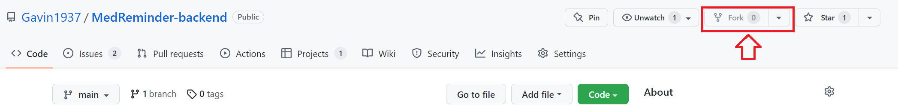

# How to Contribute to this project

> <p style="font-size:x-large;font-weight:bold">Important Notes:</p>
>
> **This document contains all kind of rules that are crucial or must-do in real-life projects.**
> 
> **In this project, I just want all of us can have a "close to real" development experience**
> 
> **Just try your best to follow these rules. Don't feel bad if you didn't follow the rules. Just have fun.**
>
> But, you must follow this one rule:
>
> # ***DO NOT DIRECTLY PUSH YOUR CHANGES TO ANY REPOSITORY!!!***
> # ***USE PULL REQUEST!!!***


## General Workflow: Fork & Pull Request

**When you are working on our project, you should follow following steps/workflow to contribute:**

1. **(Preparation) Fork the repository**
   * Use the **Fork** button on top-right corner to fork this repository
    
   * After you create a fork of original repository, github will clone the repository to your account. You will see:
    
   * This means you have a copy of the original repository in your github account.
2. **Make changes in your forked repository**
   * Make any changes to **your forked repository**
   * And then push the new changes to **your forked repository**
3. **Make a pull request to this repository**
   * After above step, you will see something similar to this:
    
   * Click on link **A.** to checkout detail of commits, and branch differences between your fork and original repository.
   * Click on **Contribute** button to open a panel. (**B.**)
     * And then you can use the green button **Open pull request** to create a pull request for project maintainers to review.
4. **More about pull requests**
   > Pull requests are proposed changes to a repository submitted by a user and accepted or rejected by a repository's collaborators. Like issues, pull requests each have their own discussion forum.
   * [About pull requests](https://docs.github.com/en/pull-requests/collaborating-with-pull-requests/proposing-changes-to-your-work-with-pull-requests/about-pull-requests)
   * [Common Git and GitHub terminology](https://docs.github.com/en/get-started/quickstart/github-glossary)
   * [Youtube Video](https://www.youtube.com/watch?v=Mfz8NQncwiQ)
5. **Directly push to other's repository is considering rude**


## Issues & Project Dashboard

We use **Issues** and **project dashboard** feature in GitHub to track everything in this project

* Checkout our [project dashboard](https://github.com/users/Gavin1937/projects/3) before you start doing anything.
* All the feature requests & bug fixes are **issues** in **Todo**, **In Progress**, **Waiting For PR**, and **Done** sections.
* When you want to work on the project
  * pick any tasks in **Todo** section, change its Assignees or simply say it in the comment
  * move the task card to **In Progress** section and working on it.
  * Once you finish the task, send a pull request and move it to the **Waiting For PR** section
  * Once your code is good to merge, close the **issue** and move the card to **Done** section.
* When you want to add a feature
  * In dedicated repository, create a new **issue** with clear title and good explanation of the feature
  * I will link that **issue** to the project ASAP
* When you found a bug in the project
  * In dedicated repository, create a new **issue** with clear title and good explanation of that bug
  * I will link that **issue** to the project ASAP
* When you want to commit some change
  * Add the task issue's id to your commit message.
  * An issues' id is the string start with `#` and follow by some number. (e.g. #4)
  * Once you commit that to GitHub, it will automatically become a link take you to the issue.
  * This can save a lot of time while navigating in GitHub.
  * Checkout this [StackOverflow Answer for detail](https://stackoverflow.com/a/6742691).


## Unit Testing

For current repository:

We will use [GitHub Actions](https://docs.github.com/en/actions) and [SpringBootTest](https://reflectoring.io/spring-boot-test/) to achieve automated unit test.

Once you send a pull request to this repository, your code will be build and test automatically, only the code which passed the test will be merge.

When you are working on a feature, you should also write its dedicate testing code.


## Code Style & Clean Code

> Programming style, also known as code style, is a set of rules or guidelines used when writing the source code for a computer program. It is often claimed that following a particular programming style will help programmers read and understand source code conforming to the style, and help to avoid introducing errors...The programming style used in a particular program may be derived from the coding conventions of a company or other computing organization, as well as the preferences of the author of the code. --- [Wikipedia](https://en.wikipedia.org/wiki/Programming_style)


**Rules:**
* **use 4 spaces for indentation**
* **variable and function names should be self explanatory**
* **variable and function names should follow [camel case](https://en.wikipedia.org/wiki/Camel_case)**
* **all the curly brackets `{}` should take a new line**
  * this is true for all the `if-else`, `loops`, `functions`, and `classes`.
* **break parentheses when contents inside are too long**
* **write clean code**
* Example:

```java
// I purposely use long names for everything in this example.
// In reality, you should create short, clean, and self explanatory names.

public ArrayList<String> updateUserName(
    Integer userId,
    String longUserFirstName, String longUserLastName
) throws SQLException
{
    
    String sql = "UPDATE users SET fname = ?, lname = ? WHERE id = ?;";
    PreparedStatement update = con.prepareStatement(sql);
    update.setString(1, longUserFirstName);
    update.setString(2, longUserLastName);
    update.setInt(3, userId);
    con.commit();
    
    int userListId = userList.findUserByFirstName(longUserFirstName);
    userList.setUserName(
        userListId,
        longUserFirstName,
        longUserLastName
    );
    userList.commit();
    
    ArrayList<String> newUserName =
        new ArrayList<String>(longFirstName, longLastName)
    ;
    return newUserName;
    
}

// Can you tell what does this function do by reading the function name and parameter?

// Can you tell what does each section do by reading them?
```

* I tried my best to show case a structured code in above example.
* But it is not as clean as others
* And, this example missed some important explanation of what does the function return. (We can add some [Javadoc Comment](https://www.oracle.com/technical-resources/articles/java/javadoc-tool.html) to explain it)
* Learn more about [Clean Code](https://www.youtube.com/watch?v=7EmboKQH8lM)

> The big take way from this section is:
> 
> **"Code Style"** and **"Clean Code"** are essentially **the code that is organized and easy to read/understand**,
> 
> Be flexible when dealing with these stuff.


## REST API

We will apply some of the [REST API philosophies](https://www.techtarget.com/searchapparchitecture/definition/RESTful-API#:~:text=A%20RESTful%20API%20%2D%2D%20also,preferred%20over%20other%20similar%20technologies.) in this backend application.

The most important parts are:

1. Use HTTP requests to correspond with CRUD database operations. Consider following table.

| DB operation    | Corresponding HTTP requests |
|-----------------|-----------------------------|
| CREATE / INSERT | POST                        |
| SELECT          | GET                         |
| UPDATE          | PUT                         |
| DELETE          | DELETE                      |

2. Use url path as the primary parameters.
3. Everything is in JSON. All the request and response data should be in json format.
4. All the api endpoints must start with `/api/...`

Example:

* If we want to add a new user to our system
* We should send a `POST` request to path `/api/addUser`
* And it should contains following json as request data:

```json
{
    "hospital_id": 0,
    "med_id": 0
}
```

* And our system should return following json when success:

```json
{
    "id": 0,
    "hospital_id": 0,
    "med_id": 0,
    "role": "patient"
}
```

* More Explanations and Examples in [ApiDocumentation](./ApiDocumentation.md)


## API Documentation

Another important part of our job is to write a clear documentation for everything we create.

When you add a new endpoint or modified an endpoint's behavior

You must add or update that endpoint in our [ApiDocumentation](./ApiDocumentation.md)

And don't forget to add same kind documentation to endpoint's function using [Javadoc Comment](https://www.oracle.com/technical-resources/articles/java/javadoc-tool.html)

Documentation will help people to understand all the functionalities of your application, and potentially help you to improve your application.

Feel free to use other endpoint's documentation in [ApiDocumentation](./ApiDocumentation.md) or [Controller](./../src/main/java/cs3337/MedReminderbackend/Controller/RestApiController.java) as your reference


## Development Environment: Debug & Build

Since this is a maven project and maven is a very popular tool for Java projects.

You can easily import this project to your IDE, and then build, run, and debug the application there.

Here are some examples:

* [Spring Boot Project in VSCode](https://www.youtube.com/watch?v=y-JNavSnjkQ)
* [Spring Tool Suite with Eclipse](https://youtu.be/Q6zUfJSsdP8?t=325)
  * [More](https://www.baeldung.com/eclipse-sts-spring)
* To Run this project manually
  * You need to have Java 17 installed.
  * open a terminal/cmd in the root of this project.
  * Use following command to build and pack the project into a .jar file

```sh
# Windows
mvn.cmd package

# MacOS, Linux, or Unix
./mvn package
```

* * Make sure there are no compile or testing errors and then continue.
  * You will see a **"target"** folder appear in the project root contains a **"MedReminder-backend.jar"** file
  * Use following command to run existing jar application

```sh
# For all os
java -jar target/MedReminder-backend.jar /path/to/your/config.json
```

* * Use following command to build and run the application (without packaging)

```sh
# Windows
mvn.cmd spring-boot:run -D"spring-boot.run.arguments"="/path/to/your/config.json"

# MacOS, Linux, or Unix
./mvn spring-boot:run -D"spring-boot.run.arguments"="/path/to/your/config.json"
```

